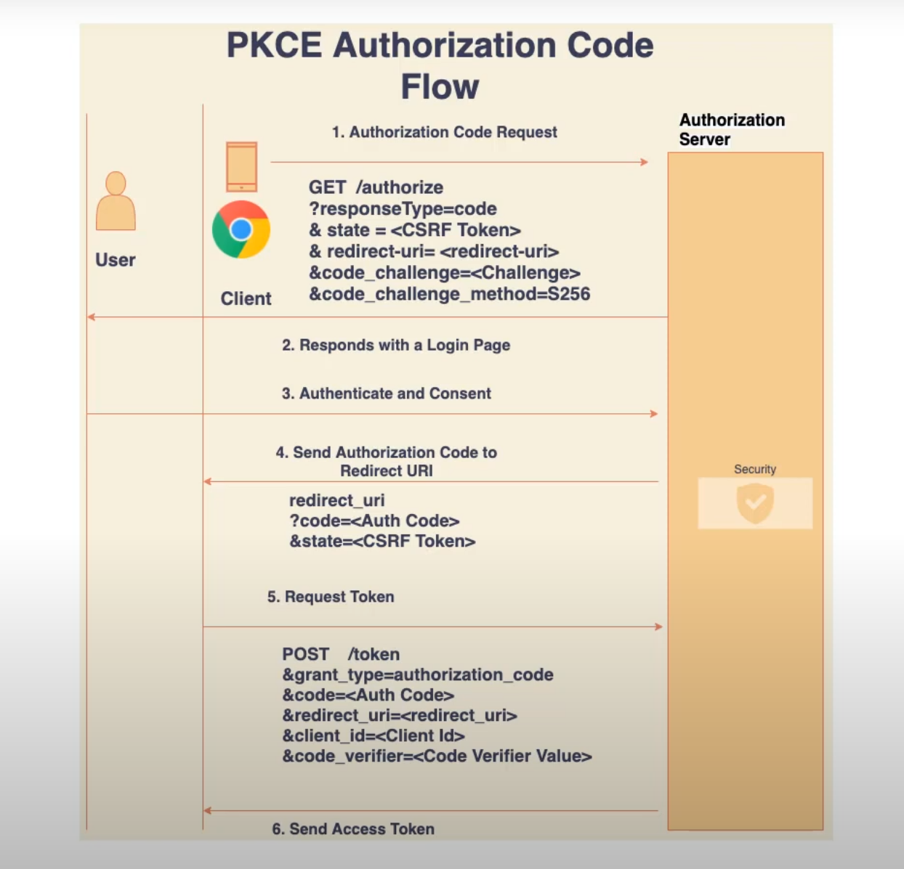
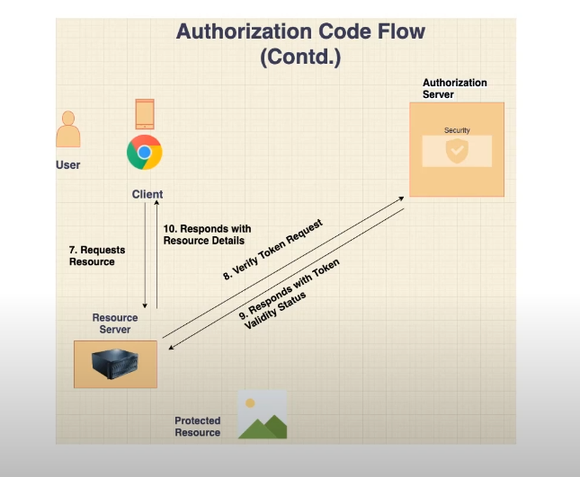
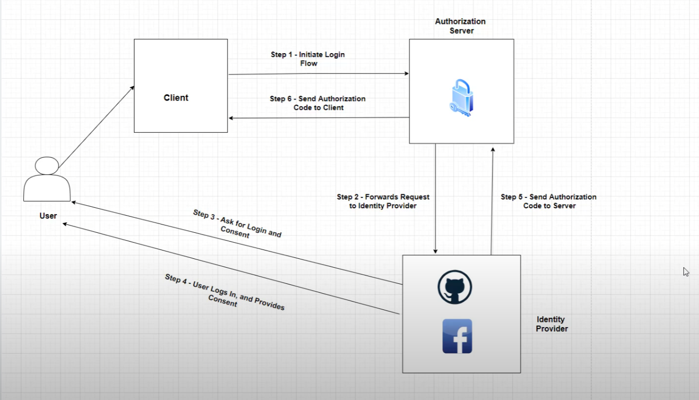

# OAuth 2.0 Standard - An Overview

OAuth 2.0 is an open standard for access delegation, commonly used for token-based authentication and authorization. It enables applications to obtain limited access to user accounts on an HTTP service, like social media platforms, without exposing user credentials.

## Core Concepts and Terminology

### Roles in OAuth 2.0
- **Resource Owner**: The user who authorizes an application to access their resources.
- **Client**: The application requesting access to the resource owner's account.
- **Resource Server**: The server hosting the protected resources, such as an API.
- **Authorization Server**: The server issuing access tokens after authenticating the resource owner and obtaining their authorization.

### Tokens
- **Access Token**: A credential used to access protected resources.
- **Refresh Token**: A credential used to obtain a new access token without requiring the user to reauthorize.

### Endpoints
1. **Authorization Endpoint**: Used by the client to obtain authorization from the resource owner.
2. **Token Endpoint**: Used by the client to exchange an authorization code or refresh token for an access token.
3. **Redirection Endpoint**: A client endpoint where the authorization server sends responses (e.g., authorization codes or tokens).

---

## OAuth 2.0 Grant Types
Grant types define the flow of the OAuth 2.0 process:

### 1. Authorization Code Grant
This is the most commonly used flow for server-side applications.
1. The client redirects the user to the authorization server.
2. The user logs in and approves the request.
3. The authorization server sends an authorization code to the client.
4. The client exchanges the code for an access token.

**Use Case**: Secure applications with backend servers.

### 2. Implicit Grant
A simplified flow for public clients (e.g., single-page applications) where the access token is issued directly.

**Use Case**: When refresh tokens are not required.

### 3. Resource Owner Password Credentials Grant
The client directly collects the user's credentials and exchanges them for an access token.

**Use Case**: Trusted applications where the user shares their credentials directly (e.g., first-party apps).

### 4. Client Credentials Grant
The client authenticates directly with the authorization server to obtain an access token.

**Use Case**: Machine-to-machine communication or backend services.

### 5. Device Code Grant
Designed for devices with limited input capabilities, like smart TVs.

**Use Case**: Internet of Things (IoT) devices.

---

## How OAuth 2.0 Works

1. **Authorization Request**: The client requests authorization from the resource owner via the authorization server.
2. **Authorization Grant**: The resource owner provides the authorization grant (e.g., code or credentials).
3. **Access Token Request**: The client exchanges the grant for an access token.
4. **Access Resource**: The client uses the access token to make requests to the resource server.

---

## Security Considerations
- Always use HTTPS to encrypt communication.
- Use PKCE (Proof Key for Code Exchange) with public clients to prevent interception of authorization codes.
- Store refresh tokens securely and avoid exposing access tokens in front-end applications.

---

## Example OAuth 2.0 Flow
Below is a simplified diagram of the Authorization Code flow:

```plaintext
+--------+                               +---------------+
|        |--(1) Authorization Request--> |               |
|        |                               | Authorization |
| Client |                               |     Server    |
|        |<--(2) Authorization Code----- |               |
|        |                               +---------------+
|        |
|        |--(3) Access Token Request---->
|        |                               +---------------+
|        |<--(4) Access Token-----------|
+--------+                               |
                                        |
+--------+                               +---------------+
|        |--(5) API Request------------> |               |
| Client |                               | Resource      |
|        |<--(6) Protected Resource----- |     Server    |
+--------+                               +---------------+
```
## Examples implemented in this repo
## Pkce Authentication process
- getting the token using pkce grant type

- verifying the token in the backend

## Implementing SSO with github and keycloak

---

## Further Reading
- [OAuth 2.0 Specification](https://tools.ietf.org/html/rfc6749)
- [OpenID Connect](https://openid.net/connect/) (Layer on top of OAuth 2.0 for identity verification)

Feel free to contribute to this repository by adding examples or use cases for OAuth 2.0 implementation!
